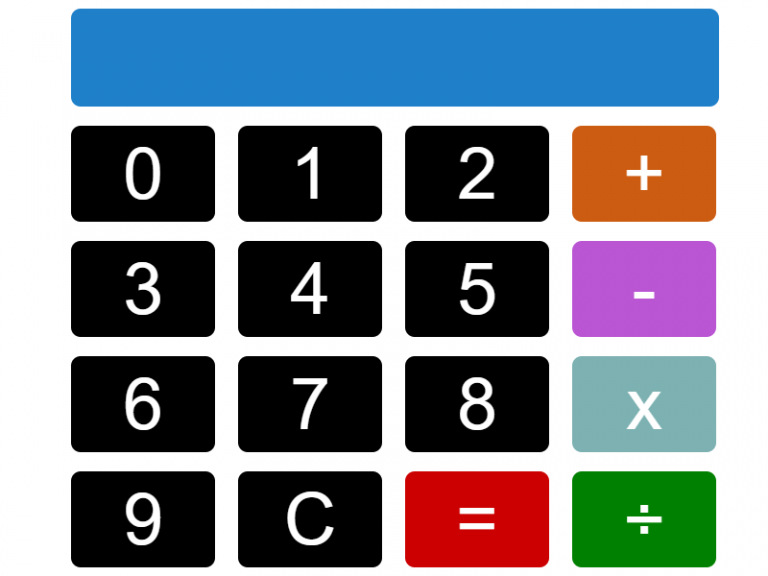

# Digital Clock

 This is a basic clock that displays the local time on your local computer.

# What You Should See
Visit the hosted github page to see this  in action.

# JavaScript Used
* JavaScript Date() Object
* Window.setInterval() method

# New Things Learned or Refreshed
But, as always, I had to refresh myself on how to retrieve only the local time from the Date() object.

Once I googled my way to the MDN documentation, every thing else became a breeze.

Oh, well, I also had to do a bit of refreshing on the CSS margin property.

What can I say?

This stuff can escape you pretty fast if you do use it every day.
